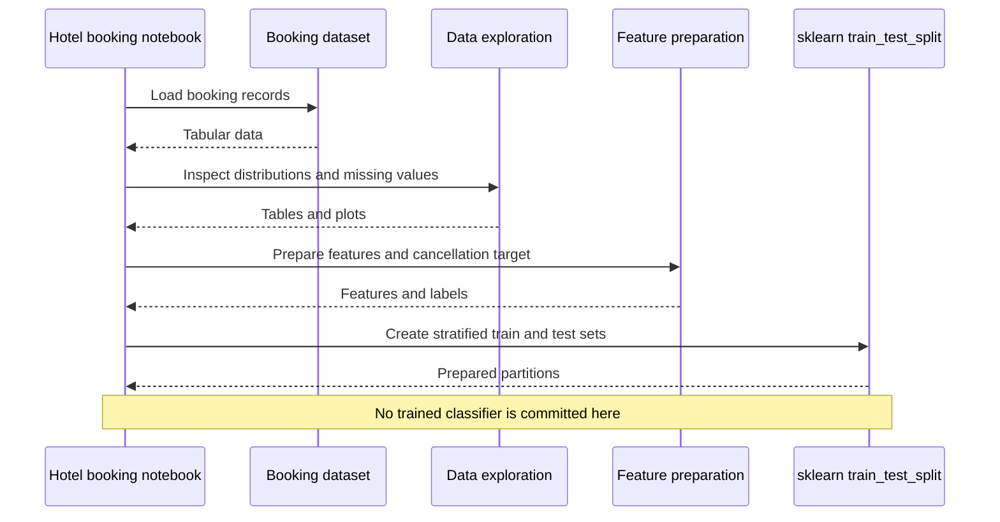

# Hotel Booking Demand Analysis

A GTC internship notebook exploring hotel booking data, preparing features, and creating a stratified train/test split for cancellation analysis.

**Technology:** Python · pandas · Matplotlib · Seaborn · missingno · scikit-learn

## Features

- Inspect booking distributions, missing values, and reservation attributes.
- Explore patterns across hotel types, guest segments, and booking characteristics.
- Prepare the dataset and split the cancellation target for subsequent modeling.

## Repository guide

| Path | Purpose |
|---|---|
| [Hotel_Booking_Demand_Analysis.ipynb](Hotel_Booking_Demand_Analysis.ipynb) | Booking EDA and data preparation. |
| [hotel_bookings - hotel_bookings.csv](hotel_bookings%20-%20hotel_bookings.csv) | Hotel booking dataset. |

## Requirements and current limitations

Replace the notebook's `/content/hotel_bookings - hotel_bookings.csv` path with the included local CSV. This checkout centers on analysis and preparation; it does not include a separate trained-model service or deployment app.

## UML diagrams

### Main workflow

The committed notebook covers exploration and preparation through a train/test split. A trained cancellation model is not part of this workflow.



## Getting started

```bash
git clone https://github.com/IbrahimAbdelsattar/gtc-ml-project1-hotel-bookings.git
cd gtc-ml-project1-hotel-bookings
```

Use a Python virtual environment:

```bash
python -m venv .venv
```

Activate it with `source .venv/bin/activate` on macOS/Linux or `.venv\Scripts\Activate.ps1` in PowerShell.

```bash
python -m pip install jupyter pandas numpy matplotlib seaborn missingno scikit-learn
python -m jupyter notebook
```

Open the notebook listed above and run its cells in order. Adjust dataset and model paths as described in the limitations section.
